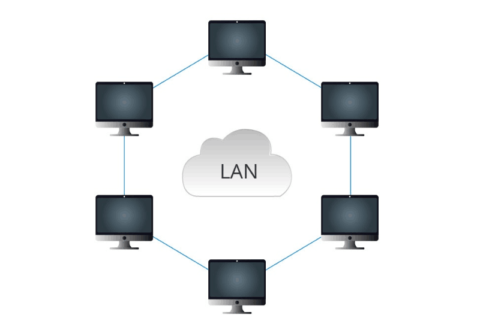
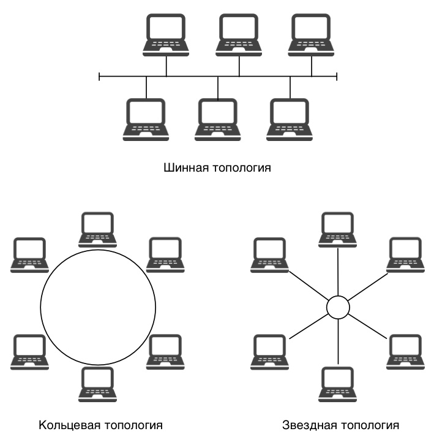

---
## Front matter
lang: ru-RU
title: Структура научной презентации
subtitle: Доклад
author:
  - Калашникова Д. В. НПИбд-01-24
institute:
  - Российский университет дружбы народов, Москва, Россия

## i18n babel
babel-lang: russian
babel-otherlangs: english

## Formatting pdf
toc: false
toc-title: Содержание
slide_level: 2
aspectratio: 169
section-titles: true
theme: metropolis
header-includes:
 - \metroset{progressbar=frametitle,sectionpage=progressbar,numbering=fraction}
---

# Информация

## Докладчик

:::::::::::::: {.columns align=center}
::: {.column width="70%"}

  * Калашникова Дарья Викторовна
  * Российский университет дружбы народов
  * [1132243108@pfur.ru](mailto:1132243108@pfur.ru)

:::
::: {.column width="30%"}

:::
::::::::::::::

# Вводная часть

## Архитектура и организация локальных сетей

 **Актуальность**  
LAN — основа цифровой инфраструктуры. Рост IoT, требования к безопасности и новые технологии (Wi-Fi 6, SDN) делают тему востребованной.  
 
**Объект и предмет**  
- *Объект*: локальные сети организаций и домов.  
- *Предмет*: архитектура, топологии, оборудование, безопасность.  
 
**Цель**  
Анализ принципов построения LAN для создания производительных и безопасных сетей.  
 
**Задачи**  
Изучить архитектуры, сравнить топологии, проанализировать оборудование и протоколы, исследовать методы защиты.

**Основная часть и заключение**  

## Что такое локальная сеть (LAN)?

:::::::::::::: {.columns align=center}
::: {.column width="70%"}

- Локальная сеть (LAN) — это группа компьютеров и устройств, соединенных в ограниченной географической области, такой как дом, офис или кампус.
- Основные характеристики:
  - Высокая скорость передачи данных
  - Низкие задержки
  - Ограниченная зона покрытия
:::
::: {.column width="30%"}

 {#fig:001 width=100%}
 
:::
::::::::::::::

## Типы архитектуры

1. **Клиент-серверная архитектура**
   - Централизованное управление ресурсами.
   - Серверы предоставляют услуги клиентам.
 
2. **P2P (Peer-to-Peer) архитектура**
   - Равноправные узлы, которые могут как предоставлять, так и запрашивать ресурсы.
   - Простота настройки и использования.
 
## Основные топологии

1. **Шинная топология**
   - Все устройства подключены к одному кабелю.
   - Простота установки, но ограниченная длина кабеля.
 
2. **Звездообразная топология**
   - Все устройства подключены к центральному коммутатору или хабу.
   - Высокая надежность, легкость в управлении.

## Основные топологии

3. **Кольцевая топология**
   - Устройства соединены в замкнутый круг.
   - Данные передаются по кругу; сбой одного устройства может остановить сеть.
 
4. **Смешанная топология**
   - Комбинация различных топологий для повышения надежности и производительности.

## Основные топологии

{#fig:001 width=40%}

## Сетевые технологии и протоколы

**1. Ethernet (IEEE 802.3)**:  
- Проводная технология.  
- Скорости: 10 Мбит/с, 100 Мбит/с (Fast Ethernet), 1 Гбит/с (Gigabit Ethernet).  
 
**2. Wi-Fi (IEEE 802.11)**:  
- Беспроводные стандарты:  
  - **802.11n** (до 600 Мбит/с).  
  - **802.11ac** (до 6,77 Гбит/с).  
  - **802.11ax (Wi-Fi 6)** (до 9,6 Гбит/с).  
 
**3. Ключевые протоколы**:  
- **TCP/IP** — основа интернета.  
- **DHCP** — автоматическое назначение IP-адресов.  
- **DNS** — преобразование доменных имен в IP-адреса.  

## Оборудование локальных сетей

**Ключевое оборудование**
 
- **Коммутаторы (Switches)**
  - Устройства для соединения нескольких устройств в сети.
  - Обеспечивают эффективную передачу данных между узлами.
 
- **Маршрутизаторы (Routers)**
  - Устройства для соединения различных сетей и управления трафиком.
  
- **Точки доступа (Access Points)**
  - Устройства для подключения беспроводных клиентов к проводной сети.

## Безопасность в LAN

:::::::::::::: {.columns align=center}
::: {.column width="70%"}

**Угрозы**:  
- Несанкционированный доступ.  
- DDoS-атаки.  
- Вирусы и вредоносное ПО.  
 
**Меры защиты**:  
- **Фаерволы** — блокируют нежелательный трафик.  
- **Шифрование** (WPA3 для Wi-Fi).  
- **VPN** — защищенный доступ к сети.  
- **Регулярные обновления ПО**.  

:::
::: {.column width="30%"}

{#fig:001 width=100%}

:::
::::::::::::::

## Заключение

Локальные сети продолжают развиваться, адаптируясь к новым технологическим вызовам. Основные тенденции:

- Рост скорости передачи данных

- Увеличение числа подключенных устройств

- Повышение требований к безопасности

- Автоматизация управления

Понимание принципов построения локальных сетей остается важным для ИТ-специалистов, позволяя создавать эффективные и надежные сетевые инфраструктуры.

