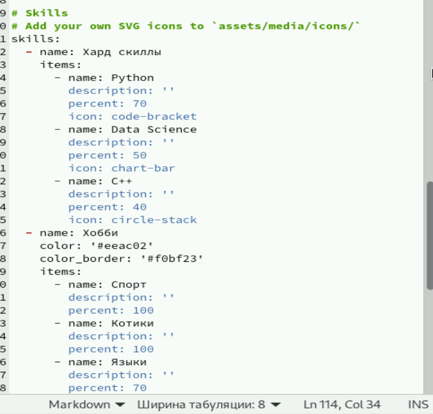
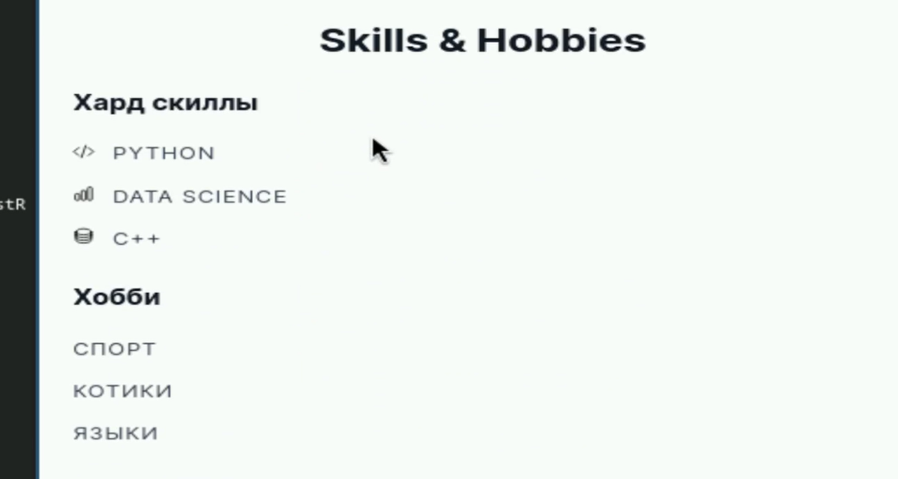
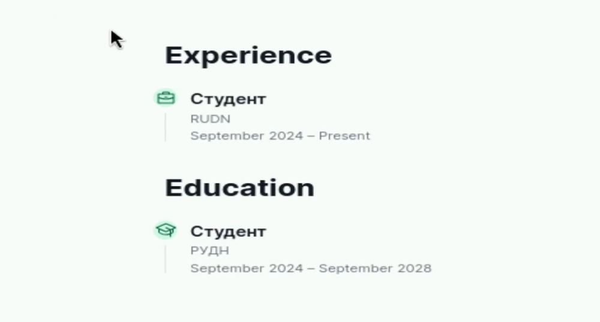
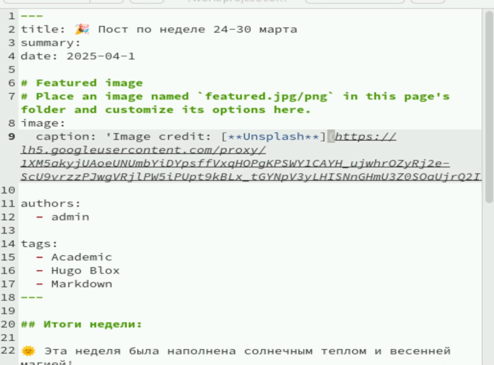
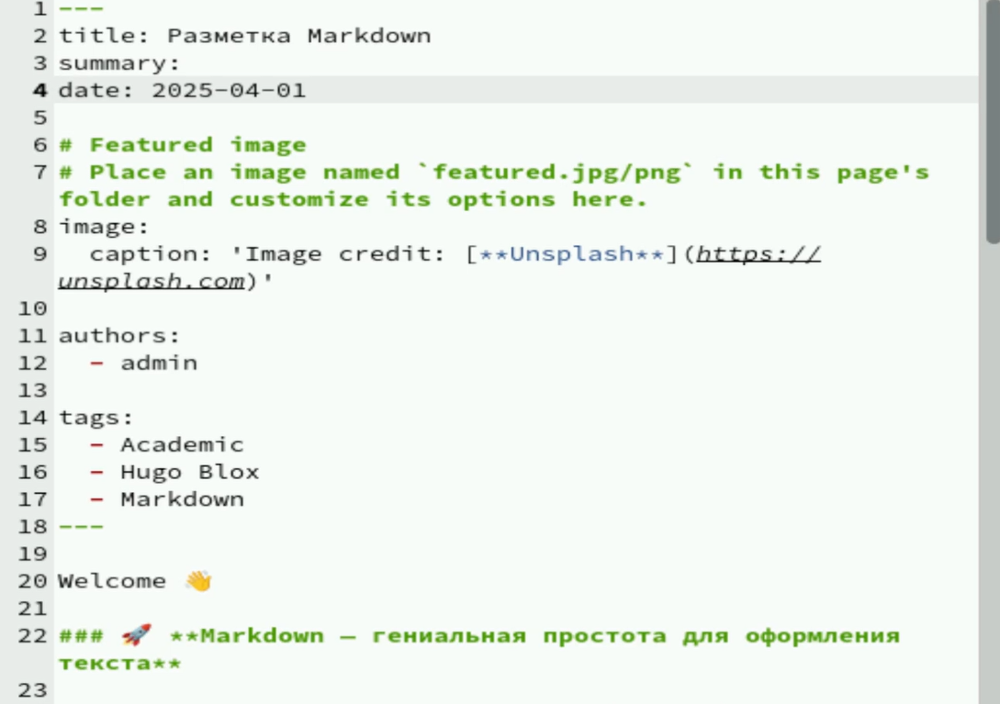

---
## Front matter
lang: ru-RU
title: Индивидуальный проект
subtitle: Часть 3
author:
  - Калашникова Д. В.
institute:
  - Российский университет дружбы народов, Москва, Россия
date: 1 апреля 2025
## i18n babel
babel-lang: russian
babel-otherlangs: english

## Formatting pdf
toc: false
toc-title: Содержание
slide_level: 2
aspectratio: 169
section-titles: true
theme: metropolis
header-includes:
 - \metroset{progressbar=frametitle,sectionpage=progressbar,numbering=fraction}
 - '\makeatletter'
 - '\beamer@ignorenonframefalse'
 - '\makeatother'
 
## Fonts
mainfont: PT Serif
romanfont: PT Serif
sansfont: PT Sans
monofont: PT Mono
mainfontoptions: Ligatures=TeX
romanfontoptions: Ligatures=TeX
sansfontoptions: Ligatures=TeX,Scale=MatchLowercase
monofontoptions: Scale=MatchLowercase,Scale=0.9
---

# Информация

## Докладчик

:::::::::::::: {.columns align=center}
::: {.column width="70%"}

  * Калашникова Дарья Викторовна
  * Студент
  * Российский университет дружбы народов
  * [1132243108@pfur.ru](mailto:1132243108@pfur.ru)

:::
::: {.column width="30%"}

:::
::::::::::::::

## Цель работы

Создать индивидуальный сайт, постепенно его заполняя

## Задание

Добавить к сайту достижения.  
Добавить информацию о навыках (Skills).  
Добавить информацию об опыте (Experience).  
Добавить информацию о достижениях (Accomplishments).  
Сделать пост по прошедшей неделе.  
Добавить пост на тему по выбору.

## Заполнение информации о навыках

Заполним информацию о навыках в файле _index.md

{height=70%}

## Вид информации о навыках

Так это будет выглядеть на сайте

{height=70%}

## Вид информации об опыте

Так это выглядит

{height=70%}

## Пост о прошедшей неделе

Напишем пост о прошедшей неделе

{height=70%}

## Пост о LaTeX

И пост о Markdown

{height=70%}

## Выводы

В результате работы была добавлена информация о навыках и опыте автора, а также написано 2 поста
